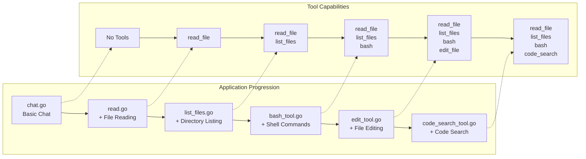
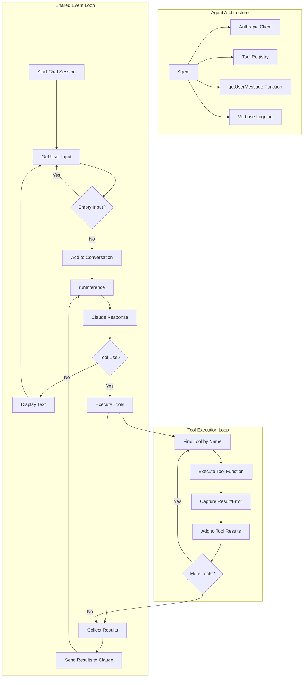

# 🧠 Build Your Own Coding Agent via a Step-by-Step Workshop

Welcome! 👋 This workshop will guide you through building your own **AI-powered coding assistant** — starting from a basic chatbot, and adding powerful tools like file reading, shell command execution, and code searching.

You don’t need to be an AI expert. Just follow along and build step-by-step!

🌐 **Want a detailed overview?** Check out the blog post: [ghuntley.com/agent](https://ghuntley.com/agent/)

---

## 🎯 What You'll Learn

By the end of this workshop, you’ll understand how to:

- ✅ Connect to the Anthropic Claude API
- ✅ Build a simple AI chatbot
- ✅ Add tools like reading files, editing code, and running commands
- ✅ Handle tool requests and errors
- ✅ Build an agent that gets smarter with each step

---

## 🛠️ What We're Building

You’ll build 6 versions of a coding assistant. 

Each version adds more features:

1. **Basic Chat** — talk to Claude
2. **File Reader** — read code files
3. **File Explorer** — list files in folders
4. **Command Runner** — run shell commands
5. **File Editor** — modify files
6. **Code Search** — search your codebase with patterns



At the end, you’ll end up with a powerful local developer assistant!


---

## 🧱 How It Works (Architecture)

Each agent works like this:

1. Waits for your input
2. Sends it to Claude
3. Claude may respond directly or ask to use a tool
4. The agent runs the tool (e.g., read a file)
5. Sends the result back to Claude
6. Claude gives you the final answer

We call this the **event loop** — it's like the agent's heartbeat.



## 🚀 Getting Started

### ✅ Prerequisites

* Go 1.24.2+ or [devenv](https://devenv.sh/) (recommended for easy setup)
* An [Anthropic API Key](https://www.anthropic.com/product/claude)

### 🔧 Set Up Your Environment

**Option 1: Recommended (using devenv)**

```bash
devenv shell  # Loads everything you need
```

**Option 2: Manual setup**

```bash
# Make sure Go is installed
go mod tidy
```

### 🔐 Add Your API Key

```bash
export ANTHROPIC_API_KEY="your-api-key-here"
```

---

## 🏁 Start with the Basics

### 1. `chat.go` — Basic Chat

A simple chatbot that talks to Claude.

```bash
go run chat.go
```

* ➡️ Try: “Hello!”
* ➡️ Add `--verbose` to see detailed logs

---

## 🛠️ Add Tools (One Step at a Time)

### 2. `read.go` — Read Files

Now Claude can read files from your computer.

```bash
go run read.go
```

* ➡️ Try: “Read fizzbuzz.js”

---

### 3. `list_files.go` — Explore Folders

Lets Claude look around your directory.

```bash
go run list_files.go
```

* ➡️ Try: “List all files in this folder”
* ➡️ Try: “What’s in fizzbuzz.js?”

---

### 4. `bash_tool.go` — Run Shell Commands

Allows Claude to run safe terminal commands.

```bash
go run bash_tool.go
```

* ➡️ Try: “Run git status”
* ➡️ Try: “List all .go files using bash”

---

### 5. `edit_tool.go` — Edit Files

Claude can now **modify code**, create files, and make changes.

```bash
go run edit_tool.go
```

* ➡️ Try: “Create a Python hello world script”
* ➡️ Try: “Add a comment to the top of fizzbuzz.js”

---

### 6. `code_search_tool.go` — Search Code

Use pattern search (powered by [ripgrep](https://github.com/BurntSushi/ripgrep)).

```bash
go run code_search_tool.go
```

* ➡️ Try: “Find all function definitions in Go files”
* ➡️ Try: “Search for TODO comments”

---

## 🧪 Sample Files (Already Included)

1. `fizzbuzz.js`: for file reading and editing
1. `riddle.txt`: a fun text file to explore
1. `AGENT.md`: info about the project environment

---

## 🐞 Troubleshooting

**API key not working?**

* Make sure it’s exported: `echo $ANTHROPIC_API_KEY`
* Check your quota on [Anthropic’s dashboard](https://www.anthropic.com)

**Go errors?**

* Run `go mod tidy`
* Make sure you’re using Go 1.24.2 or later

**Tool errors?**

* Use `--verbose` for full error logs
* Check file paths and permissions

**Environment issues?**

* Use `devenv shell` to avoid config problems

---

## 💡 How Tools Work (Under the Hood)

Tools are like plugins. You define:

* **Name** (e.g., `read_file`)
* **Input Schema** (what info it needs)
* **Function** (what it does)

Example tool definition in Go:

```go
var ToolDefinition = ToolDefinition{
    Name:        "read_file",
    Description: "Reads the contents of a file",
    InputSchema: GenerateSchema[ReadFileInput](),
    Function:    ReadFile,
}
```

Schema generation uses Go structs — so it’s easy to define and reuse.

---

## 🧭 Workshop Path: Learn by Building

| Phase | What to Focus On                                 |
| ----- | ------------------------------------------------ |
| **1** | `chat.go`: API integration and response handling |
| **2** | `read.go`: Tool system, schema generation        |
| **3** | `list_files.go`: Multiple tools, file system     |
| **4** | `bash_tool.go`: Shell execution, error capture   |
| **5** | `edit_tool.go`: File editing, safety checks      |
| **6** | `code_search_tool.go`: Pattern search, ripgrep   |

---

## 🛠️ Developer Environment (Optional)

If you use [`devenv`](https://devenv.sh/), it gives you:

* Go, Node, Python, Rust, .NET
* Git and other dev tools

```bash
devenv shell   # Load everything
devenv test    # Run checks
hello          # Greeting script
```

---

## 🚀 What's Next?

Once you complete the workshop, try building:

* Custom tools (e.g., API caller, web scraper)
* Tool chains (run tools in a sequence)
* Memory features (remember things across sessions)
* A web UI for your agent
* Integration with other AI models

---

## 📦 Summary

This workshop helps you:

* Understand agent architecture
* Learn to build smart assistants
* Grow capabilities step-by-step
* Practice using Claude and Go together

---

Have fun exploring and building your own AI-powered tools! 💻✨

If you have questions or ideas, feel free to fork the repo, open issues, or connect with the community!
