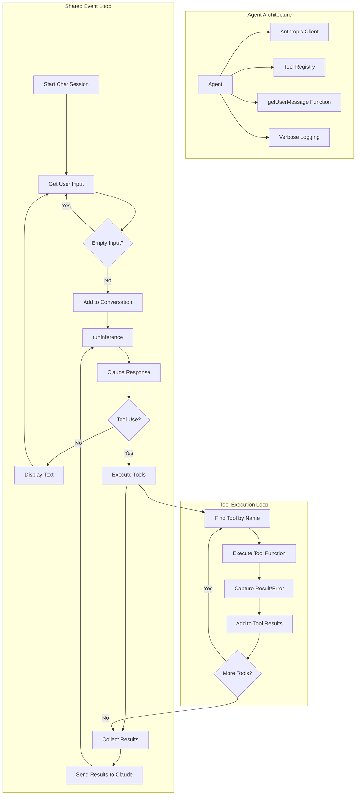
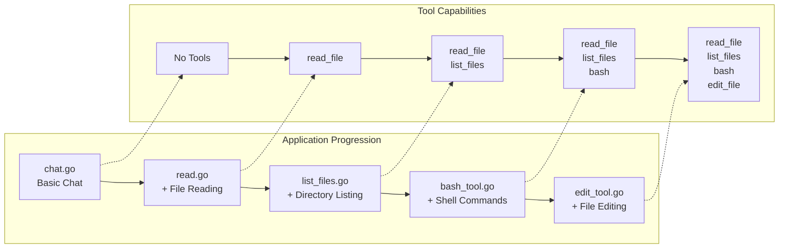
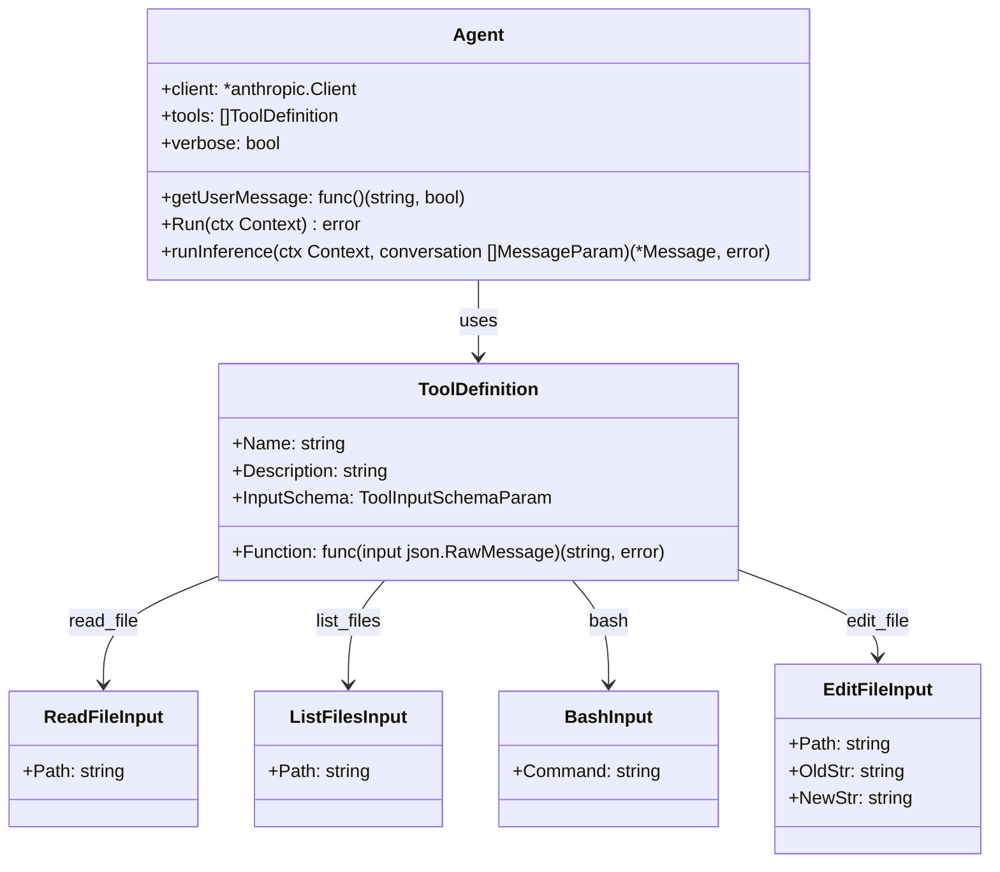

# How to Build an Agent - Workshop

A hands-on workshop for learning how to build AI agents with progressively increasing capabilities. This repository contains five different agent implementations that demonstrate the evolution from a simple chat interface to a fully capable agent with file system access and tool execution.

## 🎯 Learning Objectives

By working through this workshop, you will learn:

- How to integrate with the Anthropic Claude API
- The fundamentals of tool-calling and function execution
- How to build a robust agent event loop
- Progressive enhancement of agent capabilities
- Error handling and logging in agent systems
- Schema generation for tool parameters

## 🏗️ Architecture Overview

All applications share a common architecture pattern with a central event loop that handles user input, sends messages to Claude, processes tool calls, and returns results.



## 📚 Application Progression

The workshop is structured as a progression through five applications, each building upon the previous one's capabilities:



### 1. Basic Chat (`chat.go`)
**Purpose**: Establish the foundation - a simple chat interface with Claude

**Features**:
- Basic conversation loop
- User input handling
- API integration with Anthropic
- Verbose logging support

**Key Learning**: Understanding the core conversation pattern and API integration.

**Usage**:
```bash
go run chat.go
go run chat.go --verbose  # Enable detailed logging
```

### 2. File Reading Agent (`read.go`)
**Purpose**: Add the first tool - file reading capability

**Features**:
- Everything from `chat.go`
- `read_file` tool for reading file contents
- Tool definition and schema generation
- Tool execution and result handling

**Key Learning**: How to implement and register tools, handle tool calls from Claude.

**Usage**:
```bash
go run read.go
# Try: "Read the contents of fizzbuzz.js"
```

### 3. File Listing Agent (`list_files.go`)
**Purpose**: Expand file system access with directory listing

**Features**:
- Everything from `read.go`
- `list_files` tool for directory exploration
- Multiple tool registration
- File system traversal with filtering

**Key Learning**: Managing multiple tools and file system operations.

**Usage**:
```bash
go run list_files.go
# Try: "List all files in this directory"
# Try: "What files are available and what's in fizzbuzz.js?"
```

### 4. Bash Command Agent (`bash_tool.go`)
**Purpose**: Add shell command execution capabilities

**Features**:
- Everything from `list_files.go`
- `bash` tool for executing shell commands
- Command output capture
- Error handling for failed commands

**Key Learning**: Safe command execution and output handling.

**Usage**:
```bash
go run bash_tool.go
# Try: "Run git status"
# Try: "List all .go files using bash"
```

### 5. Full File Editing Agent (`edit_tool.go`)
**Purpose**: Complete agent with file modification capabilities

**Features**:
- Everything from `bash_tool.go`
- `edit_file` tool for modifying files
- File creation and directory creation
- String replacement with uniqueness validation

**Key Learning**: File manipulation, validation, and comprehensive agent capabilities.

**Usage**:
```bash
go run edit_tool.go
# Try: "Create a simple Python hello world script"
# Try: "Add a comment to the top of fizzbuzz.js"
```

## 🛠️ Tool System Architecture

The tool system uses a consistent pattern across all applications:



## 🚀 Setup

### Prerequisites
- [devenv](https://devenv.sh/) (recommended) or Go 1.24.2+
- Anthropic API key

### Environment Setup

1. **Using devenv (recommended)**:
```bash
devenv shell  # Enters development environment with all dependencies
```

2. **Manual setup**:
```bash
# Ensure Go 1.24.2+ is installed
go mod tidy
```

### API Key Configuration
```bash
export ANTHROPIC_API_KEY="your-api-key-here"
```

## 📖 Usage Examples

### Basic Chat
```bash
$ go run chat.go
Chat with Claude (use 'ctrl-c' to quit)
You: Hello!
Claude: Hello! How can I help you today?
```

### File Operations
```bash
$ go run edit_tool.go
Chat with Claude (use 'ctrl-c' to quit)
You: What files are in this directory?
tool: list_files({})
result: [".devenv.flake.nix",".gitignore","AGENT.md","bash_tool.go"...]
Claude: I can see several files in this directory, including Go source files for different agent implementations...

You: Read the riddle.txt file
tool: read_file({"path":"riddle.txt"})
result: I have a mane but I'm not a lion...
Claude: This is a riddle! The answer is "a horse"...
```

### Debugging with Verbose Mode
```bash
$ go run edit_tool.go --verbose
# Provides detailed logging of:
# - API calls and timing
# - Tool execution details
# - File operations
# - Error traces
```

## 🧪 Test Files

The repository includes sample files for testing:

- **`fizzbuzz.js`**: A JavaScript FizzBuzz implementation for reading/editing
- **`riddle.txt`**: A simple riddle for content analysis
- **`AGENT.md`**: Development environment documentation

## 🔧 Development Environment

This project uses [devenv](https://devenv.sh/) for reproducible development environments with:

- Go toolchain
- Node.js and TypeScript
- Python environment
- Rust toolchain
- .NET Core
- Git and common development tools

The environment automatically sets up all dependencies and provides helpful scripts:

```bash
devenv shell    # Enter development environment
devenv test     # Run environment tests
hello          # Custom greeting script
```

## 🎓 Workshop Flow

### Phase 1: Understanding the Basics
1. Start with `chat.go` to understand the conversation loop
2. Examine the API integration and response handling
3. Experiment with verbose logging

### Phase 2: Adding Tools
1. Progress to `read.go` to see tool integration
2. Understand schema generation and tool definitions
3. Practice with file reading operations

### Phase 3: Building Complexity
1. Explore `list_files.go` for multiple tool management
2. Test directory traversal and file system operations
3. Learn about tool combination strategies

### Phase 4: System Integration
1. Use `bash_tool.go` to see command execution
2. Understand error handling and output capture
3. Practice with system integration

### Phase 5: Full Agent Capabilities
1. Master `edit_tool.go` for complete file operations
2. Understand validation and safety measures
3. Build complete agent workflows

## 🔍 Key Concepts Demonstrated

### Event Loop Pattern
All agents use the same core event loop that:
1. Accepts user input
2. Maintains conversation history
3. Calls Claude API with tools
4. Processes tool use requests
5. Executes tools and collects results
6. Returns results to Claude for final response

### Tool Definition Pattern
```go
var ToolDefinition = ToolDefinition{
    Name:        "tool_name",
    Description: "What the tool does",
    InputSchema: GenerateSchema[InputStruct](),
    Function:    ToolFunction,
}
```

### Schema Generation
Automatic JSON schema generation from Go structs using reflection and jsonschema tags.

### Error Handling
Consistent error handling across all tools with proper logging and user feedback.

### Progressive Enhancement
Each application builds upon the previous one, demonstrating how to gradually add capabilities to an agent system.

## 🚦 Common Issues and Solutions

### API Key Issues
- Ensure `ANTHROPIC_API_KEY` is set in your environment
- Check that your API key has sufficient credits

### Tool Execution Errors
- Use `--verbose` flag to see detailed error logs
- Check file permissions for file operations
- Verify paths are relative to the working directory

### Environment Issues
- Use `devenv shell` for consistent environment
- Run `go mod tidy` if dependencies are missing
- Check Go version compatibility (1.24.2+)

## 🎯 Next Steps

After completing this workshop, consider exploring:

- Adding more specialized tools (web scraping, API calls, etc.)
- Implementing tool chaining and workflows
- Adding persistent memory and state management
- Building web interfaces for your agents
- Integrating with other AI models and services

---

This workshop provides a solid foundation for understanding agent architecture and tool integration. Each application demonstrates key concepts that are essential for building production-ready AI agents.
